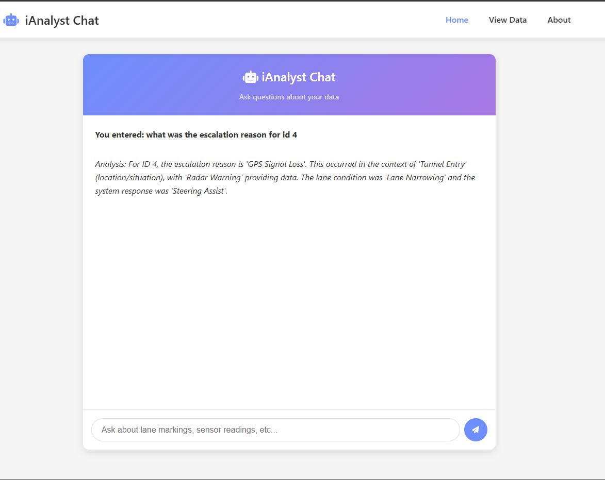

# iAnalystChat

iAnalystChat is a Flask‐based web application that lets you query and explore vehicle sensor and lane‐condition data via a chat‐style interface. It uses NLTK for keyword extraction, SQLAlchemy with SQLite for data storage, and a modern front‐end built with HTML, CSS, and JavaScript.

## Features

- Natural‐language chat interface for querying data  
- Keyword extraction (NLTK) and ID‐based lookup  
- SQLite database with SQLAlchemy ORM  
- Sample “dummy” data for testing  
- Responsive UI with message bubbles and typing indicator  